# Predicting Delayed Hospital Discharges in Scotland Using Explainable Machine Learning

[](https://www.python.org/)
[](https://jupyter.org/)
[](https://scikit-learn.org/)
[](https://xgboost.readthedocs.io/)
[](https://shap.readthedocs.io/)
[](LICENSE)

> **Master's Dissertation — University of the West of Scotland**  
> MSc Information Technology with Data Analytics | School of Computing | 2026  
> **Author:** Thomas Tafafa Anthonio (B01818359)

---

## 📋 Project Overview

Delayed hospital discharges — where patients are medically fit for release but remain in hospital beds — place significant pressure on NHS Scotland's capacity and resources. This project applies **explainable machine learning** to routinely collected NHS and Social Care data to predict the number of delayed bed days across Scottish Health Boards.

Four regression models are compared:
- Linear Regression
- Random Forest
- XGBoost
- Gradient Boosting

Model predictions are interpreted using **SHAP (SHapley Additive exPlanations)** to ensure clinical explainability and transparency.

---

## 🎯 Research Questions

1. Can routinely collected NHS and social care data predict delayed hospital discharges across Scottish Health Boards?
2. Which patient-level and system-level factors are the strongest predictors of delayed bed days?
3. How do ensemble models (Random Forest, XGBoost, Gradient Boosting) compare to a baseline Linear Regression model?
4. What actionable insights can SHAP explainability analysis provide for NHS Scotland policymakers?

---

## 📂 Repository Structure

```
nhs-delayed-discharge/
│
├── data/
│   ├── raw/                        # Original, unmodified source datasets
│   │   ├── Delayed_Discharge_NHS.csv
│   │   ├── CareInspectorate_CareHomes.xls
│   │   └── MidYear_PopulationEstimates.xlsx
│   └── processed/
│       └── NHS_Discharge_Rate.csv  # Final merged & engineered dataset
│
├── notebooks/
│   └── Dissertation1.ipynb         # Full analysis notebook (EDA → ML → SHAP)
│
│
├── results/
│   ├── models/
│   └── figures/                    # All generated plots and charts
│
├── docs/
│   └── Final_Project_Documentation.docx  # Full dissertation document
│
├── requirements.txt
├── .gitignore
└── README.md
```

---

## 📊 Datasets

Three publicly available datasets were integrated for this project:

| Dataset | Source | Description |
|--------|--------|-------------|
| NHS Delayed Discharge by Health Board | [Public Health Scotland](https://www.opendata.nhs.scot/) | Monthly delayed bed days by reason and Health Board (2019–2024) |
| Care Inspectorate Care Home Data | [Care Inspectorate](https://www.careinspectorate.com/) | Active care home services and total bed capacity per Health Board |
| Mid-Year Population Estimates | [NRS Scotland](https://www.nrscotland.gov.uk/) | Annual population by Health Board, age, and sex (1981–2024) |

> **Note:** Raw data files are not included in this repository due to size and licensing constraints. Download instructions are provided in [`data/raw/README.md`](data/raw/README.md).

---

## 🧪 Methodology

### 1. Data Preprocessing
- Removed quality flag columns, duplicates, and irrelevant rows
- Pivoted delay reasons into individual feature columns
- Converted `MonthOfDelay` to datetime; extracted `Year`, `Month`, `Quarter`
- Filtered to 2019–2024 (pre/post-COVID range)
- Engineered delay-reason **rate features** (e.g., `HealthSocialRate`)
- Created a **lag feature** (`PrevMonthDelay`) as a temporal predictor
- Merged all three datasets on Health Board code and year

### 2. Feature Engineering

| Feature | Description |
|---------|-------------|
| `prevmonthdelay` | Delayed bed days in the previous month (lag feature) |
| `healthsocialrate` | Proportion of delays due to health/social care reasons |
| `patientfamilyrate` | Proportion of delays due to patient/family reasons |
| `awirate` | Proportion of delays – Code 9 AWI |
| `nonawirate` | Proportion of delays – Code 9 Non-AWI |
| `elderlyrate` | Population aged 75+ as a proportion of total |
| `carehomecapacityrate` | Care home places per elderly resident |
| `carehomeplaces` | Total active care home beds in Health Board |
| `month`, `year` | Temporal features |
| `hb_encoded` | Label-encoded Health Board identifier |

### 3. Model Training
- **Train/Test Split:** 80/20, `random_state=42`
- **Cross-Validation:** 5-fold CV R² for all models
- **Models:** Linear Regression, Random Forest, XGBoost (200 estimators), Gradient Boosting (200 estimators)

### 4. Evaluation Metrics
- MAE (Mean Absolute Error)
- RMSE (Root Mean Squared Error)
- R² (Coefficient of Determination)
- CV R² (5-Fold Cross-Validated R²)

### 5. Explainability
- SHAP feature importance bar chart
- SHAP summary (beeswarm) plot
- Individual prediction explanations

---

## ⚙️ Installation & Setup

### Prerequisites
- Python 3.10+
- pip

### Clone the Repository
```bash
git clone https://github.com/YOUR_USERNAME/nhs-delayed-discharge.git
cd nhs-delayed-discharge
```

### Install Dependencies
```bash
pip install -r requirements.txt
```

### Launch the Notebook
```bash
jupyter notebook notebooks/Dissertation1.ipynb
```

---

## 📦 Dependencies

See [`requirements.txt`](requirements.txt) for the full list. Key libraries:

| Library | Purpose |
|---------|---------|
| `pandas` | Data manipulation |
| `numpy` | Numerical computation |
| `matplotlib` / `seaborn` | Data visualisation |
| `scikit-learn` | ML models, metrics, cross-validation |
| `xgboost` | XGBoost regressor |
| `shap` | Model explainability |
| `jupyter` | Interactive notebook environment |

---

## 📈 Key Results

> Full results and figures are available in the [`results/figures/`](model_results/) directory and the dissertation document.

| Model | MAE | RMSE | R² | CV R² |
|-------|-----|------|----|-------|
| Linear Regression | 291 | 501 | 0.973 | 0.928 |
| Random Forest | 307 | 545 | 0.967 | 0.867 |
| XGBoost | 307 | 518 | 0.971 | 0.845 |
| Gradient Boosting | 287 | 496 | 0.973 | 0.831 |

## 📊 EDA Visualisations

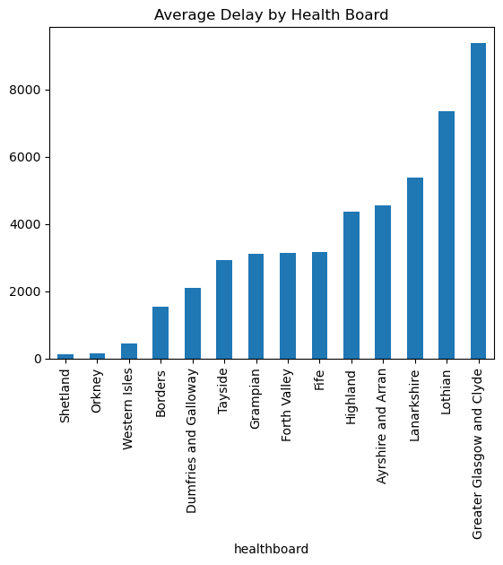

**What this shows:**  
Average delayed bed days across Scottish Health Boards.

**Key insight:**  
Large urban boards (e.g. Greater Glasgow & Clyde, Lothian) have significantly higher delays compared to smaller regions like Orkney and Shetland.

**Why it matters:**  
This highlights geographic inequality and suggests that system pressure is concentrated in high-population areas.

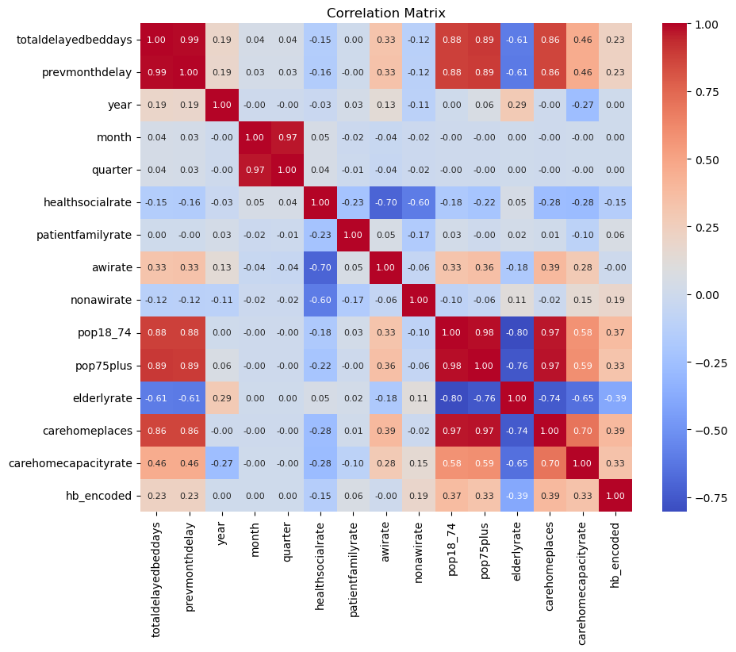

**What this shows:**  
Relationships between all features used in the model.

**Key insight:**  
`prevmonthdelay` is almost perfectly correlated with current delays (~0.99), confirming strong temporal dependence.  
Population and care home variables also show strong positive relationships.

**Why it matters:**  
Delayed discharges are highly predictable using past trends, validating the use of time-based features.

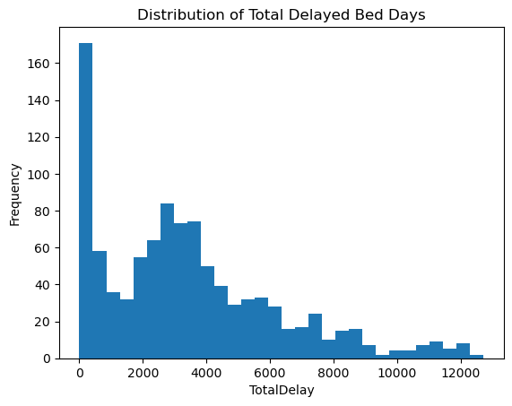

**What this shows:**  
Distribution of total delayed bed days.

**Key insight:**  
The distribution is right-skewed, with a long tail of high-delay values.

**Why it matters:**  
Extreme delay periods exist, requiring models that handle non-linear patterns (e.g. Random Forest, XGBoost).

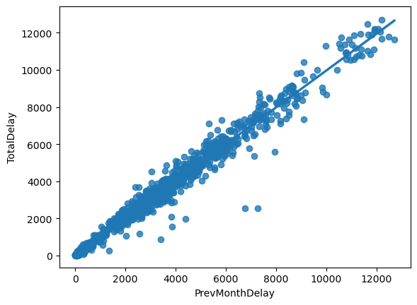

**What this shows:**  
Relationship between previous month delays and total delays.

**Key insight:**  
Strong linear relationship with minimal scatter.

**Why it matters:**  
This is the strongest predictive signal — delayed discharges are highly persistent over time.

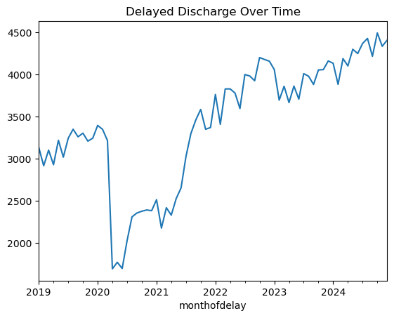

**What this shows:**  
Trend of delayed discharges from 2019 to 2024.

**Key insight:**  
Sharp drop around 2020 (COVID disruption), followed by a steady increase and recovery.

**Why it matters:**  
Confirms external shocks affect discharge patterns and validates inclusion of temporal features.

## 🤖 Model Results

### Linear Regression

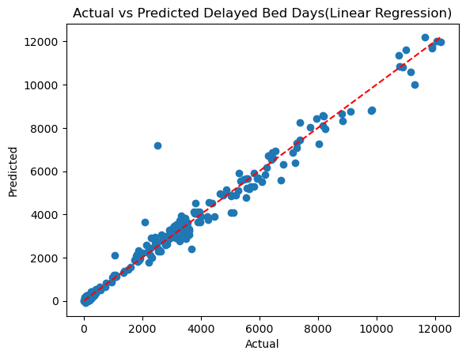
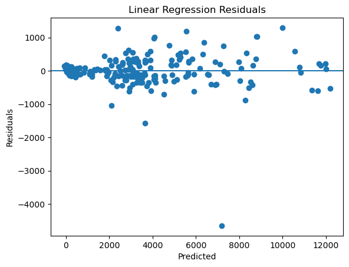

**What this shows:**  
A baseline linear model predicting delayed bed days.

**Performance insight:**  
Predictions follow the general trend but show wider dispersion compared to other models.

**Residual analysis:**  
Residuals are spread unevenly, with larger errors at higher values, indicating the model struggles with extreme delays.

**Conclusion:**  
Linear Regression captures the overall trend but fails to model non-linear relationships in the data.

**Takeaway:**  
Useful as a baseline, but insufficient for accurate real-world prediction.

### Random Forest

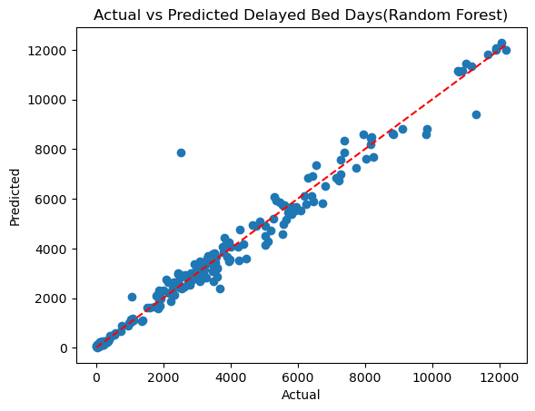
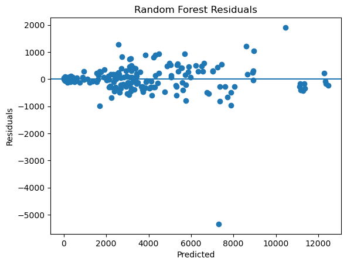

**What this shows:**  
An ensemble model using multiple decision trees.

**Performance insight:**  
Predictions closely align with actual values, showing improved accuracy over linear regression.

**Residual analysis:**  
Residuals are more tightly clustered around zero, though some large errors remain at higher values.

**Conclusion:**  
Random Forest effectively captures non-linear patterns and interactions in the data.

**Takeaway:**  
A strong performer with good generalisation, suitable for practical use.

### XGBoost

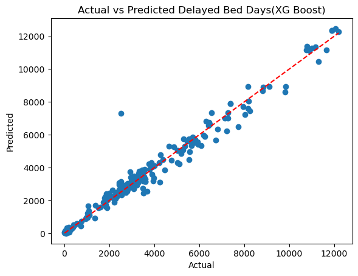
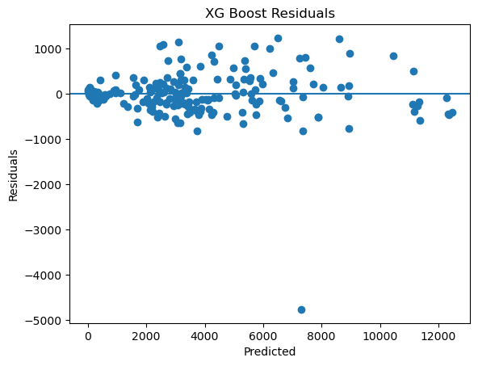

**What this shows:**  
A gradient boosting model optimised for performance.

**Performance insight:**  
Predictions show very tight alignment with actual values, indicating high accuracy.

**Residual analysis:**  
Residuals are centred around zero with relatively low variance compared to other models.

**Conclusion:**  
XGBoost provides the best balance between accuracy and stability.

**Takeaway:**  
The most reliable model for predicting delayed discharges in this project.

### Gradient Boosting

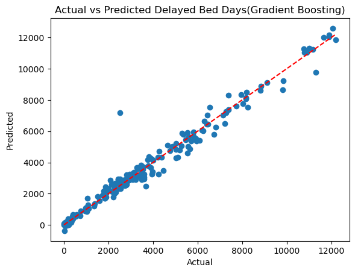
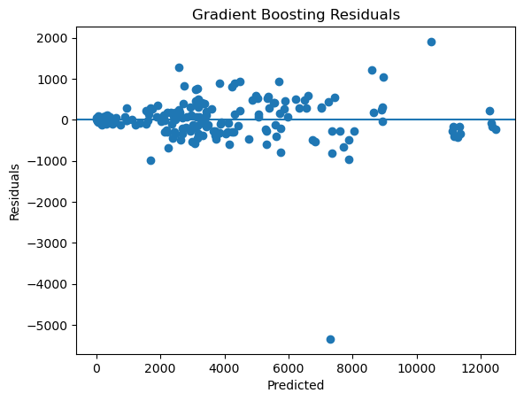

**What this shows:**  
A boosting model that sequentially improves prediction errors.

**Performance insight:**  
Predictions closely match actual values, similar to XGBoost.

**Residual analysis:**  
Residuals are mostly centred around zero but show some spread at higher predictions.

**Conclusion:**  
Gradient Boosting performs strongly but is slightly less stable than XGBoost.

**Takeaway:**  
A high-performing model, though marginally outperformed by XGBoost.

## 🧠 Explainability (SHAP)
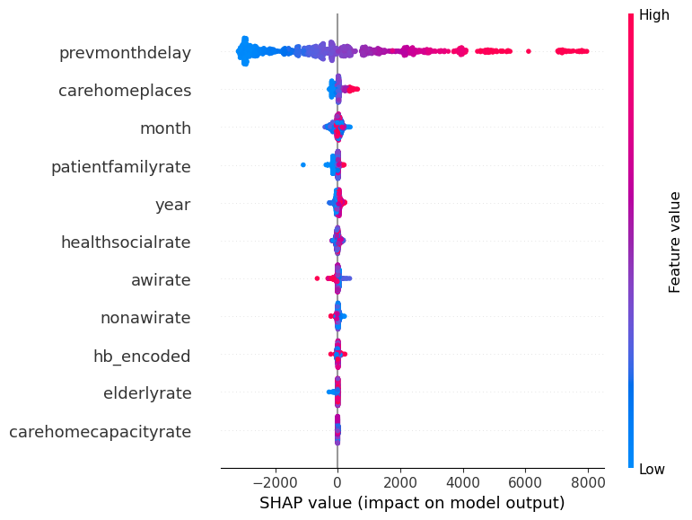

**What this shows:**  
How each feature affects predictions across all observations.

**Key insight:**  
- High `prevmonthdelay` strongly increases predicted delays  
- Social care factors push predictions upward  
- Effects are consistent across observations  

**Why it matters:**  
Provides transparent, actionable insights for NHS decision-makers.

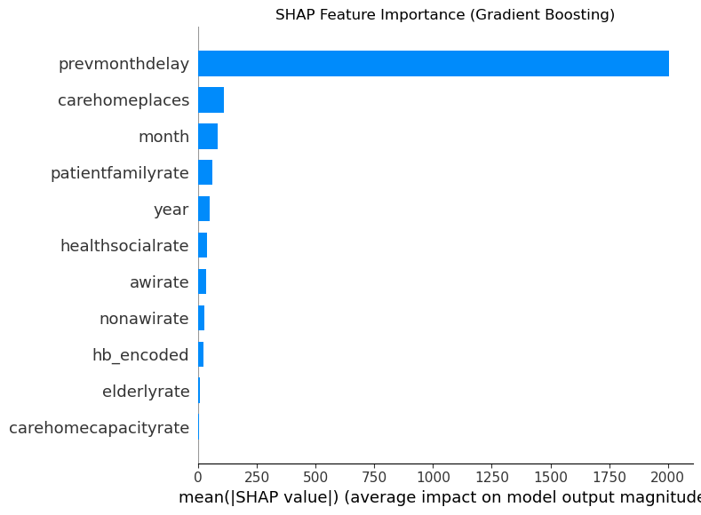

**What this shows:**  
Average contribution of each feature to model predictions.

**Key insight:**  
`prevmonthdelay` has the largest impact by a significant margin.  
Other variables have smaller but meaningful contributions.

**Why it matters:**  
Confirms the model is driven by logical, interpretable factors.

## 🔍 Feature Importance

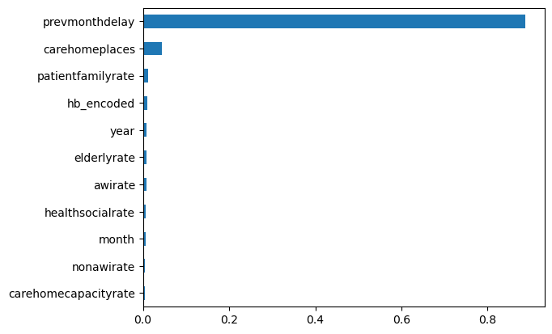
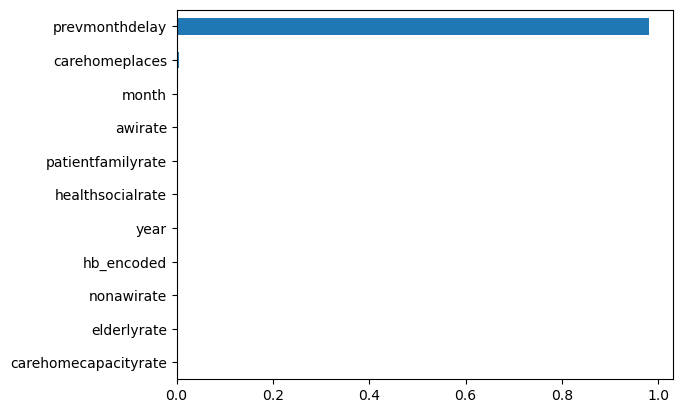
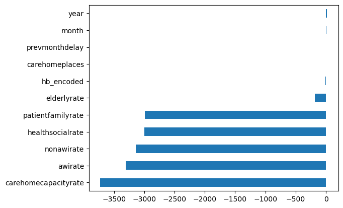

---

## 🏥 Clinical & Policy Relevance

This project demonstrates that routinely collected administrative data — with no additional data collection burden — can power predictive models accurate enough for NHS planning purposes. SHAP explainability ensures results are interpretable by non-technical stakeholders such as Health Board managers and social care planners.

---

## ⚠️ Ethical Considerations

- All data used is **publicly available and fully anonymised** at Health Board level — no individual patient data was accessed.
- The project complies with University of the West of Scotland academic integrity policies.
- Generative AI tools (Grammarly for grammar; QuillBot for paraphrasing) were used only for writing assistance. All analysis and code is original.

---

## 📄 License

This project is licensed under the [MIT License](LICENSE).

---

## 👤 Author

**Thomas Tafafa Anthonio**  
MSc Information Technology with Data Analytics  
University of the West of Scotland, School of Computing  
Student ID: B01818359

---

## 🙏 Acknowledgements

Supervised by **Md Shakil Amid**, School of Computing, University of the West of Scotland.  
Special thanks to Mrs Rolanda Ayisa Cudjoe for her unwavering support throughout this degree.
